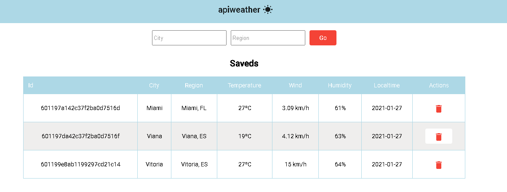

# APIWEATHER
Aplicação para pesquisa de previsão de tempo em cidades, com persistencia de dados e consumo da API da HG Brasil https://hgbrasil.com/

# Como usar
- npm install no diretório de server e apiweather
- inicializar o mongo db (database: "dbweather", collection: "card")
- executar no diretório server "node app", 127.0.0.1:3000
- executar no diretório apiweather "ng serve", 127.0.0.1:4200

# Para caso a listagem não estiver aparecendo
- Verificar erro de verbo http no console: (Access to XMLHttpRequest)
	- Instalar a extensao no navegador "Acess-Control-Allow-Origin" e seguir os passos do video
	
# Tecnologias
- Angular 
- NodeJS
- MongoDB
